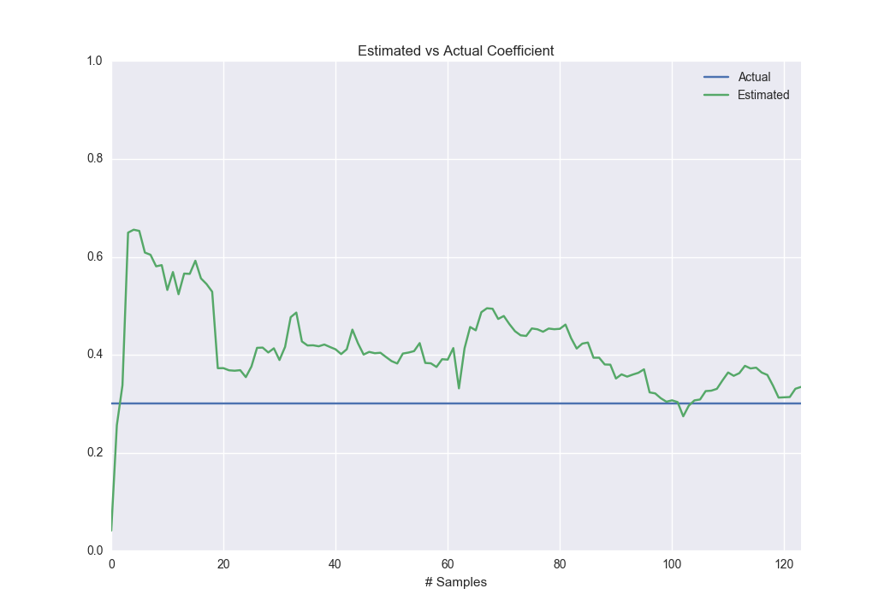

# PyOnline - Online Learning Algorithms in Python

This library contains online versions of commonly used learning algorithms such as Ridge Regression, Covariance Estimation, and the P2 algorithm for approximating percentiles. The API is inspired by Scikit-learn and in fact, they all inherit from the `sklearn.BaseEstimator`, which allows these models to be used in Scikit-Learn's cross validation, pipeline, or union tools. 

The motivation and algorithms chosen for this library is highly influenced by the [LiveStats](https://bitbucket.org/scassidy/livestats) repository by Sean Cassidy.

## Installation

For now, you'll want to [download this repository as a zip file](https://bitbucket.org/ccphillippi/pyonline/get/master.zip) and install via:

```bash
	pip install pyonline.zip
```

## Tutorial

### Ridge Regression

The ridge regression is the most basic model provided here. It's effectively a linear regression, with a Bayesion prior on the coefficients, such that they are distributed as a normal distribution with a mean of 0 and variance of ```1. / precision```. In practice, this penalizes large coefficients, providing a more robust fit. 

We'll start by specifying our ```RidgeRegression``` with the `span=250` parameter, which specifies our maximum statistical sample size, and a 'precision=.1` parameter, which specifies our prior of our coefficient distribution:
```python
from pyonline.ridge import RidgeRegression
ridge = RidgeRegression(span=250, precision=5.)
```

Next, let's introduce some test data along with the actual coefficients (```true_coefficients```):
```python
import numpy as np

# Set up our true coefficients
true_coefficients = np.array(
	[[ .3, -.1], # Y1 =  .3 * X1 - .1 * X2 + y1_noise
	 [-.1,  .3]] # Y2 = -.1 * X1 + .3 * X2 + y2_noise
)

random_state = np.random.RandomState(1)
X = random_state.normal(0, 1, (125, 2))
Y = X.dot(true_coefficients) + random_state.normal(0, 1, (125, 2))
```

You can still estimate the ridge regression in batch just as you would with the scikit-learn API:
```python
# We'll train on the first 100 points and test on the remaining 25 points
ridge.fit(X[:100], Y[:100])

print("Actual coefs:\n%s" % true_coefficients)
print("Estimated coefs:\n%s" % ridge.coef_)
print("Out of sample R2:\n%.4f" % ridge.score(X[100:], Y[100:]))
```
```
Actual coefs:
[[ 0.3 -0.1]
 [-0.1  0.3]]
Estimated coefs:
[[ 0.32256367 -0.15270524]
 [-0.07430376  0.45857161]]
Out of sample R2:
0.0514
```

However, the value of this library is that you can estimate incrementally, one to `n` row(s) at a time. Let's show how to do the same process in the previous cell incrementally. This will further allow us to inspect our estimated coefficients at each step:
```python
# Let's reset the state of the ridge regression
ridge = RidgeRegression(span=250, precision=5.)

y_pred = []
y_true = []
coefs = []
for x_train, y_train, x_next, y_next in zip(X[:-1], Y[:-1], X[1:], Y[1:]):
	# train on this row, and predict the next row
	ridge.partial_fit(np.array([x_train]), np.array([y_train]))
	predicted_y_next = ridge.predict(np.array([x_next]))

	# Save predicted(y), actual(y), and coefficients
	y_pred.append(predicted_y_next)
	y_true.append(y_next)
	coefs.append(ridge.coef_)

# Next we can plot it out:
import pandas as pd
import seaborn
from pylab import show, xlabel

plot_data = pd.DataFrame(dict(Estimated=[coef[0, 0] for coef in coefs],
							  Actual=true_coefficients[0, 0]))
plot_data.plot(ylim=(0., 1.), title='Estimated vs Actual Coefficient')
xlabel('# Samples')
show()
```

